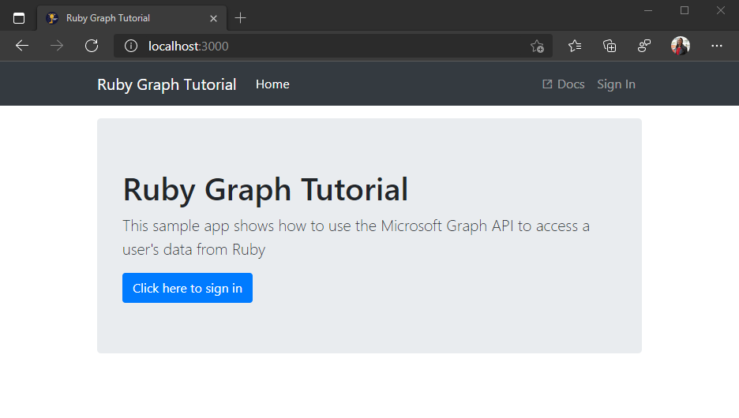

<!-- markdownlint-disable MD002 MD041 -->

In dieser Übung verwenden Sie [Ruby on Rails, um](https://rubyonrails.org/) eine Web-App zu erstellen.

1. Wenn Sie Rails noch nicht installiert haben, können Sie es über die Befehlszeilenschnittstelle (CLI) mit dem folgenden Befehl installieren.

    ```Shell
    gem install rails -v 6.1.3.1
    ```

1. Öffnen Sie Ihre CLI, navigieren Sie zu einem Verzeichnis, in dem Sie über die Rechte zum Erstellen von Dateien verfügen, und führen Sie den folgenden Befehl aus, um eine neue Rails-App zu erstellen.

    ```Shell
    rails new graph-tutorial
    ```

1. Navigieren Sie zu diesem neuen Verzeichnis, und geben Sie den folgenden Befehl ein, um einen lokalen Webserver zu starten.

    ```Shell
    rails server
    ```

1. Öffnen Sie Ihren Browser und navigieren Sie zu `http://localhost:3000`. Wenn alles funktioniert, wird ein "Yay! You're on Rails!" Nachricht. Wenn diese Meldung nicht angezeigt wird, überprüfen Sie die [Anleitung "Rails getting started".](http://guides.rubyonrails.org/)

## <a name="install-gems"></a>Installieren von Gems

Installieren Sie vor dem Wechsel einige zusätzliche Gems, die Sie später verwenden werden:

- [omniauth-oauth2 für](https://github.com/omniauth/omniauth-oauth2) die Verarbeitung von Anmelde- und OAuth-Tokenflüssen.
- [omniauth-rails_csrf_protection](https://github.com/cookpad/omniauth-rails_csrf_protection) zum Hinzufügen von CSRF-Schutz zu OmniAuth.
- [httparty](https://github.com/jnunemaker/httparty) für Anrufe an Microsoft Graph.
- [activerecord-session_store](https://github.com/rails/activerecord-session_store) zum Speichern von Sitzungen in der Datenbank.

1. Öffnen **Sie ./Gemfile,** und fügen Sie die folgenden Zeilen hinzu.

    :::code language="ruby" source="../demo/graph-tutorial/Gemfile" id="GemFileSnippet":::

1. Führen Sie in Ihrer CLI den folgenden Befehl aus.

    ```Shell
    bundle install
    ```

1. Führen Sie in Der CLI die folgenden Befehle aus, um die Datenbank zum Speichern von Sitzungen zu konfigurieren.

    ```Shell
    rails generate active_record:session_migration
    rake db:migrate
    ```

1. Erstellen Sie eine neue Datei, die `session_store.rb` im **Verzeichnis ./config/initializers** aufgerufen wird, und fügen Sie den folgenden Code hinzu.

    :::code language="ruby" source="../demo/graph-tutorial/config/initializers/session_store.rb" id="SessionStoreSnippet":::

## <a name="design-the-app"></a>Entwerfen der App

In diesem Abschnitt erstellen Sie die grundlegende Benutzeroberfläche für die App.

1. Öffnen **Sie ./app/views/layouts/application.html.erb,** und ersetzen Sie den Inhalt durch Folgendes.

    :::code language="html" source="../demo/graph-tutorial/app/views/layouts/application.html.erb" id="LayoutSnippet":::

    Dieser Code fügt [Bootstrap für](http://getbootstrap.com/) einfache Formatierung und [Fabric Core](https://developer.microsoft.com/fluentui#/get-started#fabric-core) für einige einfache Symbole hinzu. Außerdem wird ein globales Layout mit einer Navigationsleiste definiert.

1. Öffnen **Sie ./app/assets/stylesheets/application.css,** und fügen Sie am Ende der Datei Folgendes hinzu.

    :::code language="css" source="../demo/graph-tutorial/app/assets/stylesheets/application.css" id="CssSnippet":::

1. Generieren Sie einen Startseitencontroller mit dem folgenden Befehl.

    ```Shell
    rails generate controller Home index
    ```

1. Konfigurieren Sie `index` die Aktion auf dem Controller als `Home` Standardseite für die App. Öffnen **Sie ./config/routes.rb,** und ersetzen Sie dessen Inhalt durch Folgendes:

    ```ruby
    Rails.application.routes.draw do
      get 'home/index'
      root 'home#index'

      # Add future routes here

    end
    ```

1. Öffnen **Sie ./app/view/home/index.html.erb,** und ersetzen Sie dessen Inhalt durch Folgendes.

    :::code language="html" source="../demo/graph-tutorial/app/views/home/index.html.erb" id="HomeSnippet":::

1. Fügen Sie eine PNG-Datei **no-profile-photo.png** **im Verzeichnis ./app/assets/images** hinzu.

1. Speichern Sie alle Änderungen, und starten Sie den Server neu. Jetzt sollte die App ganz anders aussehen.

    
