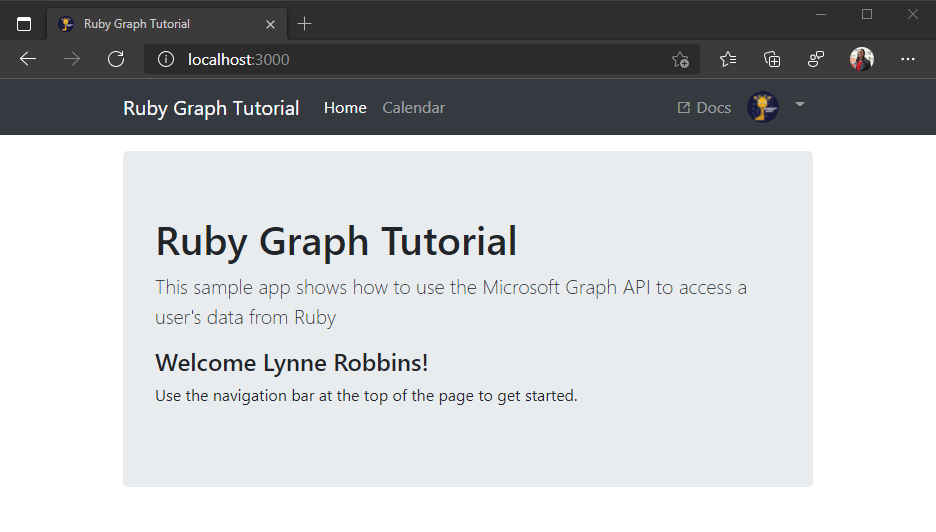

<!-- markdownlint-disable MD002 MD041 -->

<span data-ttu-id="3345e-101">In dieser Übung erweitern Sie die Anwendung aus der vorherigen Übung, um die Authentifizierung mit Azure AD zu unterstützen.</span><span class="sxs-lookup"><span data-stu-id="3345e-101">In this exercise you will extend the application from the previous exercise to support authentication with Azure AD.</span></span> <span data-ttu-id="3345e-102">Dies ist erforderlich, um das erforderliche OAuth-Zugriffstoken zum Aufrufen von Microsoft Graph zu erhalten.</span><span class="sxs-lookup"><span data-stu-id="3345e-102">This is required to obtain the necessary OAuth access token to call the Microsoft Graph.</span></span> <span data-ttu-id="3345e-103">In diesem Schritt integrieren Sie das [omniauth-oauth2-](https://github.com/omniauth/omniauth-oauth2) Juwel in die Anwendung und erstellen eine benutzerdefinierte omniauth-Strategie.</span><span class="sxs-lookup"><span data-stu-id="3345e-103">In this step you will integrate the [omniauth-oauth2](https://github.com/omniauth/omniauth-oauth2) gem into the application, and create a custom OmniAuth strategy.</span></span>

1. <span data-ttu-id="3345e-104">Erstellen Sie eine separate Datei, die Ihre APP-ID und den geheimen Schlüssel aufbewahren soll.</span><span class="sxs-lookup"><span data-stu-id="3345e-104">Create a separate file to hold your app ID and secret.</span></span> <span data-ttu-id="3345e-105">Erstellen Sie eine neue Datei `oauth_environment_variables.rb` mit dem Namen im Ordner **./config** , und fügen Sie den folgenden Code hinzu.</span><span class="sxs-lookup"><span data-stu-id="3345e-105">Create a new file called `oauth_environment_variables.rb` in the **./config** folder, and add the following code.</span></span>

    :::code language="ruby" source="../demo/graph-tutorial/config/oauth_environment_variables.rb.example":::

1. <span data-ttu-id="3345e-106">Ersetzen `YOUR_APP_ID_HERE` Sie durch die Anwendungs-ID aus dem Anwendungs Registrierungs Portal, `YOUR_APP_SECRET_HERE` und ersetzen Sie durch das Kennwort, das Sie generiert haben.</span><span class="sxs-lookup"><span data-stu-id="3345e-106">Replace `YOUR_APP_ID_HERE` with the application ID from the Application Registration Portal, and replace `YOUR_APP_SECRET_HERE` with the password you generated.</span></span>

    > [!IMPORTANT]
    > <span data-ttu-id="3345e-107">Wenn Sie die Quellcodeverwaltung wie git verwenden, wäre es jetzt ein guter Zeitpunkt, die Datei `oauth_environment_variables.rb` aus der Quellcodeverwaltung auszuschließen, damit versehentlich keine APP-ID und Ihr Kennwort verloren gehen.</span><span class="sxs-lookup"><span data-stu-id="3345e-107">If you're using source control such as git, now would be a good time to exclude the `oauth_environment_variables.rb` file from source control to avoid inadvertently leaking your app ID and password.</span></span>

1. <span data-ttu-id="3345e-108">Öffnen Sie **/config/Environment.RB** , und fügen Sie vor der `Rails.application.initialize!` Codezeile den folgenden Code hinzu.</span><span class="sxs-lookup"><span data-stu-id="3345e-108">Open **./config/environment.rb** and add the following code before the `Rails.application.initialize!` line.</span></span>

    :::code language="ruby" source="../demo/graph-tutorial/config/environment.rb" id="LoadOAuthSettingsSnippet" highlight="4-6":::

## <a name="setup-omniauth"></a><span data-ttu-id="3345e-109">Setup OmniAuth</span><span class="sxs-lookup"><span data-stu-id="3345e-109">Setup OmniAuth</span></span>

<span data-ttu-id="3345e-110">Sie haben das `omniauth-oauth2` gem bereits installiert, aber damit es mit den Azure OAuth-Endpunkten funktioniert, müssen Sie [eine OAuth2-Strategie erstellen](https://github.com/omniauth/omniauth-oauth2#creating-an-oauth2-strategy).</span><span class="sxs-lookup"><span data-stu-id="3345e-110">You've already installed the `omniauth-oauth2` gem, but in order to make it work with the Azure OAuth endpoints, you need to [create an OAuth2 strategy](https://github.com/omniauth/omniauth-oauth2#creating-an-oauth2-strategy).</span></span> <span data-ttu-id="3345e-111">Dies ist eine Ruby-Klasse, die die Parameter für die Erstellung von OAuth-Anforderungen an den Azure-Anbieter definiert.</span><span class="sxs-lookup"><span data-stu-id="3345e-111">This is a Ruby class that defines the parameters for making OAuth requests to the Azure provider.</span></span>

1. <span data-ttu-id="3345e-112">Erstellen Sie eine neue Datei `microsoft_graph_auth.rb` mit dem Namen im Ordner **./lib**' \* \*, und fügen Sie den folgenden Code hinzu.</span><span class="sxs-lookup"><span data-stu-id="3345e-112">Create a new file called `microsoft_graph_auth.rb` in the **./lib**\`\*\* folder, and add the following code.</span></span>

    :::code language="ruby" source="../demo/graph-tutorial/lib/microsoft_graph_auth.rb" id="AuthStrategySnippet":::

    <span data-ttu-id="3345e-113">Nehmen Sie sich einen Moment Zeit, um zu überprüfen, was dieser Code tut.</span><span class="sxs-lookup"><span data-stu-id="3345e-113">Take a moment to review what this code does.</span></span>

    - <span data-ttu-id="3345e-114">Sie legt die `client_options` fest, um die Microsoft Identity Platform-Endpunkte anzugeben.</span><span class="sxs-lookup"><span data-stu-id="3345e-114">It sets the `client_options` to specify the Microsoft identity platform endpoints.</span></span>
    - <span data-ttu-id="3345e-115">Er gibt an, `scope` dass der Parameter während der Autorisierungsphase gesendet werden soll.</span><span class="sxs-lookup"><span data-stu-id="3345e-115">It specifies that the `scope` parameter should be sent during the authorize phase.</span></span>
    - <span data-ttu-id="3345e-116">Die `id` Eigenschaft des Benutzers wird als eindeutige ID für den Benutzer zugeordnet.</span><span class="sxs-lookup"><span data-stu-id="3345e-116">It maps the `id` property of the user as the unique ID for the user.</span></span>
    - <span data-ttu-id="3345e-117">Es verwendet das Zugriffstoken zum Abrufen des Benutzerprofils aus Microsoft Graph, um den `raw_info` Hash auszufüllen.</span><span class="sxs-lookup"><span data-stu-id="3345e-117">It uses the access token to retrieve the user's profile from Microsoft Graph to fill in the `raw_info` hash.</span></span>
    - <span data-ttu-id="3345e-118">Die Rückruf-URL wird überschrieben, um sicherzustellen, dass Sie mit dem registrierten Rückruf im App-Registrierungs Portal übereinstimmt.</span><span class="sxs-lookup"><span data-stu-id="3345e-118">It overrides the callback URL to ensure that it matches the registered callback in the app registration portal.</span></span>

1. <span data-ttu-id="3345e-119">Erstellen Sie eine neue Datei `omniauth_graph.rb` mit dem Namen im Ordner **./config/initializers** , und fügen Sie den folgenden Code hinzu.</span><span class="sxs-lookup"><span data-stu-id="3345e-119">Create a new file called `omniauth_graph.rb` in the **./config/initializers** folder, and add the following code.</span></span>

    :::code language="ruby" source="../demo/graph-tutorial/config/initializers/omniauth_graph.rb" id="ConfigureOmniAuthSnippet":::

    <span data-ttu-id="3345e-120">Dieser Code wird ausgeführt, wenn die APP gestartet wird.</span><span class="sxs-lookup"><span data-stu-id="3345e-120">This code will execute when the app starts.</span></span> <span data-ttu-id="3345e-121">Es lädt die OmniAuth-Middleware mit dem `microsoft_graph_auth` Anbieter, der mit den Umgebungsvariablen konfiguriert ist, die in **oauth_environment_variables. RB**festgelegt sind.</span><span class="sxs-lookup"><span data-stu-id="3345e-121">It loads up the OmniAuth middleware with the `microsoft_graph_auth` provider, configured with the environment variables set in **oauth_environment_variables.rb**.</span></span>

## <a name="implement-sign-in"></a><span data-ttu-id="3345e-122">Implementieren der Anmeldung</span><span class="sxs-lookup"><span data-stu-id="3345e-122">Implement sign-in</span></span>

<span data-ttu-id="3345e-123">Nachdem die OmniAuth-Middleware nun konfiguriert wurde, können Sie mit dem Hinzufügen der Anmeldung zur APP fortfahren.</span><span class="sxs-lookup"><span data-stu-id="3345e-123">Now that the OmniAuth middleware is configured, you can move on to adding sign-in to the app.</span></span>

1. <span data-ttu-id="3345e-124">Führen Sie den folgenden Befehl in der CLI aus, um einen Controller für die Anmeldung und Abmeldung zu generieren.</span><span class="sxs-lookup"><span data-stu-id="3345e-124">Run the following command in your CLI to generate a controller for sign-in and sign-out.</span></span>

    ```Shell
    rails generate controller Auth
    ```

1. <span data-ttu-id="3345e-125">Öffnen Sie **./app/Controllers/auth_controller. RB**.</span><span class="sxs-lookup"><span data-stu-id="3345e-125">Open **./app/controllers/auth_controller.rb**.</span></span> <span data-ttu-id="3345e-126">Fügen Sie der `AuthController` -Klasse eine Rückrufmethode hinzu.</span><span class="sxs-lookup"><span data-stu-id="3345e-126">Add a callback method to the `AuthController` class.</span></span> <span data-ttu-id="3345e-127">Diese Methode wird von der OmniAuth-Middleware aufgerufen, sobald der OAuth-Fluss abgeschlossen ist.</span><span class="sxs-lookup"><span data-stu-id="3345e-127">This method will be called by the OmniAuth middleware once the OAuth flow is complete.</span></span>

    ```ruby
    def callback
      # Access the authentication hash for omniauth
      data = request.env['omniauth.auth']

      # Temporary for testing!
      render json: data.to_json
    end
    ```

    <span data-ttu-id="3345e-128">Im Moment wird der von OmniAuth bereitgestellte Hash gerendert.</span><span class="sxs-lookup"><span data-stu-id="3345e-128">For now all this does is render the hash provided by OmniAuth.</span></span> <span data-ttu-id="3345e-129">Verwenden Sie diese, um zu überprüfen, ob die Anmeldung funktionsfähig ist, bevor Sie fortfahren.</span><span class="sxs-lookup"><span data-stu-id="3345e-129">You'll use this to verify that sign-in is working before moving on.</span></span>

1. <span data-ttu-id="3345e-130">Fügen Sie die Routen zu **./config/routes.RB**hinzu.</span><span class="sxs-lookup"><span data-stu-id="3345e-130">Add the routes to **./config/routes.rb**.</span></span>

    ```ruby
    # Add route for OmniAuth callback
    match '/auth/:provider/callback', to: 'auth#callback', via: [:get, :post]
    ```

1. <span data-ttu-id="3345e-131">Starten Sie den Server, und `https://localhost:3000`navigieren Sie zu.</span><span class="sxs-lookup"><span data-stu-id="3345e-131">Start the server and browse to `https://localhost:3000`.</span></span> <span data-ttu-id="3345e-132">Klicken Sie auf die Schaltfläche zum Anmelden, um zu `https://login.microsoftonline.com`weitergeleitet zu werden.</span><span class="sxs-lookup"><span data-stu-id="3345e-132">Click the sign-in button and you should be redirected to `https://login.microsoftonline.com`.</span></span> <span data-ttu-id="3345e-133">Melden Sie sich mit Ihrem Microsoft-Konto an, und stimmen Sie den angeforderten Berechtigungen zu.</span><span class="sxs-lookup"><span data-stu-id="3345e-133">Login with your Microsoft account and consent to the requested permissions.</span></span> <span data-ttu-id="3345e-134">Der Browser wird an die APP umgeleitet, wobei der von OmniAuth generierte Hash angezeigt wird.</span><span class="sxs-lookup"><span data-stu-id="3345e-134">The browser redirects to the app, showing the hash generated by OmniAuth.</span></span>

    ```json
    {
      "provider": "microsoft_graph_auth",
      "uid": "eb52b3b2-c4ac-4b4f-bacd-d5f7ece55df0",
      "info": {
        "name": null
      },
      "credentials": {
        "token": "eyJ0eXAi...",
        "refresh_token": "OAQABAAA...",
        "expires_at": 1529517383,
        "expires": true
      },
      "extra": {
        "raw_info": {
          "@odata.context": "https://graph.microsoft.com/v1.0/$metadata#users/$entity",
          "id": "eb52b3b2-c4ac-4b4f-bacd-d5f7ece55df0",
          "businessPhones": [
            "+1 425 555 0109"
          ],
          "displayName": "Adele Vance",
          "givenName": "Adele",
          "jobTitle": "Retail Manager",
          "mail": "AdeleV@contoso.onmicrosoft.com",
          "mobilePhone": null,
          "officeLocation": "18/2111",
          "preferredLanguage": "en-US",
          "surname": "Vance",
          "userPrincipalName": "AdeleV@contoso.onmicrosoft.com"
        }
      }
    }
    ```

## <a name="storing-the-tokens"></a><span data-ttu-id="3345e-135">Speichern des Tokens</span><span class="sxs-lookup"><span data-stu-id="3345e-135">Storing the tokens</span></span>

<span data-ttu-id="3345e-136">Nun, da Sie Token abrufen können, ist es an der Zeit, eine Möglichkeit einzurichten, diese in der App zu speichern.</span><span class="sxs-lookup"><span data-stu-id="3345e-136">Now that you can get tokens, it's time to implement a way to store them in the app.</span></span> <span data-ttu-id="3345e-137">Da es sich um eine Beispiel-App handelt, speichern Sie Sie aus Gründen der Einfachheit in der Sitzung.</span><span class="sxs-lookup"><span data-stu-id="3345e-137">Since this is a sample app, for simplicity's sake, you'll store them in the session.</span></span> <span data-ttu-id="3345e-138">Eine echte App würde eine zuverlässigere sichere Speicherlösung wie eine Datenbank verwenden.</span><span class="sxs-lookup"><span data-stu-id="3345e-138">A real-world app would use a more reliable secure storage solution, like a database.</span></span>

1. <span data-ttu-id="3345e-139">Öffnen Sie **./app/Controllers/application_controller. RB**.</span><span class="sxs-lookup"><span data-stu-id="3345e-139">Open **./app/controllers/application_controller.rb**.</span></span> <span data-ttu-id="3345e-140">Fügen Sie der Klasse `ApplicationController` die folgende Methode hinzu.</span><span class="sxs-lookup"><span data-stu-id="3345e-140">Add the following method to the `ApplicationController` class.</span></span>

    :::code language="ruby" source="../demo/graph-tutorial/app/controllers/application_controller.rb" id="SaveInSessionSnippet":::

    <span data-ttu-id="3345e-141">Die-Methode verwendet den OmniAuth-Hash als Parameter und extrahiert die relevanten Informationsbits und speichert diese dann in der Sitzung.</span><span class="sxs-lookup"><span data-stu-id="3345e-141">The method takes the OmniAuth hash as a parameter and extracts the relevant bits of information, then stores that in the session.</span></span>

1. <span data-ttu-id="3345e-142">Fügen Sie der `ApplicationController` Klasse Accessorfunktionen hinzu, um den Benutzernamen, die e-Mail-Adresse und das Zugriffstoken wieder aus der Sitzung abzurufen.</span><span class="sxs-lookup"><span data-stu-id="3345e-142">Add accessor functions to the `ApplicationController` class to retrieve the user name, email address, and access token back out of the session.</span></span>

    ```ruby
    def user_name
      session[:user_name]
    end

    def user_email
      session[:user_email]
    end

    def access_token
      session[:graph_token_hash][:token]
    end
    ```

1. <span data-ttu-id="3345e-143">Fügen Sie den folgenden Code zur `ApplicationController` Klasse hinzu, die ausgeführt wird, bevor eine Aktion verarbeitet wird.</span><span class="sxs-lookup"><span data-stu-id="3345e-143">Add the following code to the `ApplicationController` class that will run before any action is processed.</span></span>

    :::code language="ruby" source="../demo/graph-tutorial/app/controllers/application_controller.rb" id="BeforeActionSnippet":::

    <span data-ttu-id="3345e-144">Mit dieser Methode werden die Variablen festgelegt, die das Layout (in **Application. html. Erb**) verwendet, um die Benutzerinformationen in der Navigationsleiste anzuzeigen.</span><span class="sxs-lookup"><span data-stu-id="3345e-144">This method sets the variables that the layout (in **application.html.erb**) uses to show the user's information in the nav bar.</span></span> <span data-ttu-id="3345e-145">Wenn Sie ihn hier hinzufügen, müssen Sie diesen Code nicht in jeder einzelnen Controller Aktion hinzufügen.</span><span class="sxs-lookup"><span data-stu-id="3345e-145">By adding it here, you don't have to add this code in every single controller action.</span></span> <span data-ttu-id="3345e-146">Dies wird jedoch auch für Aktionen in der `AuthController`ausgeführt, was nicht optimal ist.</span><span class="sxs-lookup"><span data-stu-id="3345e-146">However, this will also run for actions in the `AuthController`, which isn't optimal.</span></span>

1. <span data-ttu-id="3345e-147">Fügen Sie der `AuthController` Klasse in **./app/Controllers/auth_controller. RB** den folgenden Code hinzu, um die before-Aktion zu überspringen.</span><span class="sxs-lookup"><span data-stu-id="3345e-147">Add the following code to the `AuthController` class in **./app/controllers/auth_controller.rb** to skip the before action.</span></span>

    ```ruby
    skip_before_action :set_user
    ```

1. <span data-ttu-id="3345e-148">Aktualisieren Sie `callback` die-Funktion `AuthController` in der-Klasse, um die Token in der Sitzung zu speichern und zur Hauptseite zurückzuleiten.</span><span class="sxs-lookup"><span data-stu-id="3345e-148">Update the `callback` function in the `AuthController` class to store the tokens in the session and redirect back to the main page.</span></span> <span data-ttu-id="3345e-149">Ersetzen Sie die vorhandene `callback`-Funktion durch Folgendes.</span><span class="sxs-lookup"><span data-stu-id="3345e-149">Replace the existing `callback` function with the following.</span></span>

    :::code language="ruby" source="../demo/graph-tutorial/app/controllers/auth_controller.rb" id="CallbackSnippet":::

## <a name="implement-sign-out"></a><span data-ttu-id="3345e-150">Implementieren der Abmeldung</span><span class="sxs-lookup"><span data-stu-id="3345e-150">Implement sign-out</span></span>

<span data-ttu-id="3345e-151">Bevor Sie dieses neue Feature testen, fügen Sie eine Möglichkeit zum Abmelden hinzu.</span><span class="sxs-lookup"><span data-stu-id="3345e-151">Before you test this new feature, add a way to sign out.</span></span>

1. <span data-ttu-id="3345e-152">Fügen Sie der `AuthController` Klasse die folgende Aktion hinzu.</span><span class="sxs-lookup"><span data-stu-id="3345e-152">Add the following action to the `AuthController` class.</span></span>

    :::code language="ruby" source="../demo/graph-tutorial/app/controllers/auth_controller.rb" id="SignOutSnippet":::

1. <span data-ttu-id="3345e-153">Fügen Sie diese Aktion zu **./config/routes.RB**.</span><span class="sxs-lookup"><span data-stu-id="3345e-153">Add this action to **./config/routes.rb**.</span></span>

    ```ruby
    get 'auth/signout'
    ```

1. <span data-ttu-id="3345e-154">Starten Sie den Server neu, und fahren Sie mit dem Anmeldevorgang fort.</span><span class="sxs-lookup"><span data-stu-id="3345e-154">Restart the server and go through the sign-in process.</span></span> <span data-ttu-id="3345e-155">Sie sollten wieder auf der Startseite enden, aber die Benutzeroberfläche sollte sich ändern, um anzugeben, dass Sie angemeldet sind.</span><span class="sxs-lookup"><span data-stu-id="3345e-155">You should end up back on the home page, but the UI should change to indicate that you are signed-in.</span></span>

    

1. <span data-ttu-id="3345e-157">Klicken Sie in der oberen rechten Ecke auf den Avatar des Benutzers, um auf den **Abmelde** Link zuzugreifen.</span><span class="sxs-lookup"><span data-stu-id="3345e-157">Click the user avatar in the top right corner to access the **Sign Out** link.</span></span> <span data-ttu-id="3345e-158">Wenn Sie auf **Abmelden** klicken, wird die Sitzung zurückgesetzt und Sie kehren zur Startseite zurück.</span><span class="sxs-lookup"><span data-stu-id="3345e-158">Clicking **Sign Out** resets the session and returns you to the home page.</span></span>

    

## <a name="refreshing-tokens"></a><span data-ttu-id="3345e-160">Aktualisieren von Token</span><span class="sxs-lookup"><span data-stu-id="3345e-160">Refreshing tokens</span></span>

<span data-ttu-id="3345e-161">Wenn Sie sich den von OmniAuth generierten Hash genauer ansehen, werden Sie feststellen, dass der Hash zwei Token enthält `token` : `refresh_token`und.</span><span class="sxs-lookup"><span data-stu-id="3345e-161">If you look closely at the hash generated by OmniAuth, you'll notice there are two tokens in the hash: `token` and `refresh_token`.</span></span> <span data-ttu-id="3345e-162">Der Wert in `token` ist das Zugriffstoken, das in der `Authorization` Kopfzeile von API-aufrufen gesendet wird.</span><span class="sxs-lookup"><span data-stu-id="3345e-162">The value in `token` is the access token, which is sent in the `Authorization` header of API calls.</span></span> <span data-ttu-id="3345e-163">Dies ist das Token, das es der App ermöglicht, im Namen des Benutzers auf Microsoft Graph zuzugreifen.</span><span class="sxs-lookup"><span data-stu-id="3345e-163">This is the token that allows the app to access the Microsoft Graph on the user's behalf.</span></span>

<span data-ttu-id="3345e-164">Dieses Token ist jedoch nur kurzzeitig verfügbar.</span><span class="sxs-lookup"><span data-stu-id="3345e-164">However, this token is short-lived.</span></span> <span data-ttu-id="3345e-165">Das Token läuft eine Stunde nach seiner Ausgabe ab.</span><span class="sxs-lookup"><span data-stu-id="3345e-165">The token expires an hour after it is issued.</span></span> <span data-ttu-id="3345e-166">Hier wird der `refresh_token` Wert nützlich.</span><span class="sxs-lookup"><span data-stu-id="3345e-166">This is where the `refresh_token` value becomes useful.</span></span> <span data-ttu-id="3345e-167">Anhand des Aktualisierungstoken ist die App in der Lage, ein neues Zugriffstoken anzufordern, ohne dass der Benutzer sich erneut anmelden muss.</span><span class="sxs-lookup"><span data-stu-id="3345e-167">The refresh token allows the app to request a new access token without requiring the user to sign in again.</span></span> <span data-ttu-id="3345e-168">Aktualisieren Sie den Token-Verwaltungscode, um die Token-Aktualisierung zu implementieren.</span><span class="sxs-lookup"><span data-stu-id="3345e-168">Update the token management code to implement token refresh.</span></span>

1. <span data-ttu-id="3345e-169">Öffnen Sie **./app/Controllers/application_controller. RB** , und fügen `require` Sie die folgenden Anweisungen am oberen Rand hinzu:</span><span class="sxs-lookup"><span data-stu-id="3345e-169">Open **./app/controllers/application_controller.rb** and add the following `require` statements at the top:</span></span>

    ```ruby
    require 'microsoft_graph_auth'
    require 'oauth2'
    ```

1. <span data-ttu-id="3345e-170">Fügen Sie der Klasse `ApplicationController` die folgende Methode hinzu.</span><span class="sxs-lookup"><span data-stu-id="3345e-170">Add the following method to the `ApplicationController` class.</span></span>

    :::code language="ruby" source="../demo/graph-tutorial/app/controllers/application_controller.rb" id="RefreshTokensSnippet":::

    <span data-ttu-id="3345e-171">Diese Methode verwendet das [oauth2](https://github.com/oauth-xx/oauth2) -gem (eine Abhängigkeit des `omniauth-oauth2` gem), um die Tokens zu aktualisieren, und aktualisiert die Sitzung.</span><span class="sxs-lookup"><span data-stu-id="3345e-171">This method uses the [oauth2](https://github.com/oauth-xx/oauth2) gem (a dependency of the `omniauth-oauth2` gem) to refresh the tokens, and updates the session.</span></span>

1. <span data-ttu-id="3345e-172">Ersetzen Sie die `access_token` aktuelle Methode durch Folgendes.</span><span class="sxs-lookup"><span data-stu-id="3345e-172">Replace the current `access_token` method with the following.</span></span>

    :::code language="ruby" source="../demo/graph-tutorial/app/controllers/application_controller.rb" id="AccessTokenSnippet":::

    <span data-ttu-id="3345e-173">Anstatt lediglich das Token aus der Sitzung zurückzugeben, wird zunächst überprüft, ob es in der Nähe des Ablaufs ist.</span><span class="sxs-lookup"><span data-stu-id="3345e-173">Instead of just returning the token from the session, it will first check if it is close to expiration.</span></span> <span data-ttu-id="3345e-174">Wenn dies der Fall ist, wird es vor dem Zurückgeben des Tokens aktualisiert.</span><span class="sxs-lookup"><span data-stu-id="3345e-174">If it is, then it will refresh before returning the token.</span></span>
