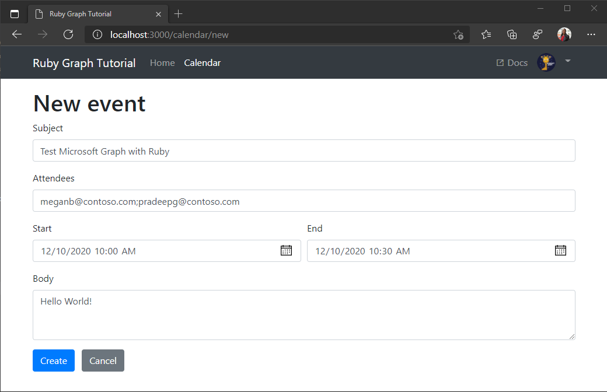

<!-- markdownlint-disable MD002 MD041 -->

<span data-ttu-id="5575d-101">In diesem Abschnitt können Sie die Möglichkeit zum Erstellen von Ereignissen im Kalender des Benutzers hinzufügen.</span><span class="sxs-lookup"><span data-stu-id="5575d-101">In this section you will add the ability to create events on the user's calendar.</span></span>

1. <span data-ttu-id="5575d-102">Öffnen Sie **/App/Helpers/graph_helper. RB** , und fügen Sie die folgende Methode zur **Graph** -Klasse hinzu.</span><span class="sxs-lookup"><span data-stu-id="5575d-102">Open **./app/helpers/graph_helper.rb** and add the following method to the **Graph** class.</span></span>

    :::code language="ruby" source="../demo/graph-tutorial/app/helpers/graph_helper.rb" id="CreateEventSnippet":::

1. <span data-ttu-id="5575d-103">Öffnen Sie **./app/Controllers/calendar_controller** , und fügen Sie der **CalendarController** -Klasse die folgende Route hinzu.</span><span class="sxs-lookup"><span data-stu-id="5575d-103">Open **./app/controllers/calendar_controller** and add the following route to the **CalendarController** class.</span></span>

    :::code language="ruby" source="../demo/graph-tutorial/app/controllers/calendar_controller.rb" id="CreateEventRouteSnippet":::

1. <span data-ttu-id="5575d-104">Öffnen Sie **./config/routes.RB** , und fügen Sie die neue Route hinzu.</span><span class="sxs-lookup"><span data-stu-id="5575d-104">Open **./config/routes.rb** and add the new route.</span></span>

    ```ruby
    post 'calendar/new', :to => 'calendar#create'
    ```

1. <span data-ttu-id="5575d-105">Öffnen Sie **./app/views/Calendar/new.html. Erb** , und ersetzen Sie den Inhalt durch Folgendes.</span><span class="sxs-lookup"><span data-stu-id="5575d-105">Open **./app/views/calendar/new.html.erb** and replace its contents with the following.</span></span>

    :::code language="html" source="../demo/graph-tutorial/app/views/calendar/new.html.erb" id="NewEventFormSnippet":::

1. <span data-ttu-id="5575d-106">Speichern Sie Ihre Änderungen, und aktualisieren Sie die app.</span><span class="sxs-lookup"><span data-stu-id="5575d-106">Save your changes and refresh the app.</span></span> <span data-ttu-id="5575d-107">Klicken Sie auf der Seite **Kalender** auf die Schaltfläche **Neues Ereignis** .</span><span class="sxs-lookup"><span data-stu-id="5575d-107">On the **Calendar** page, select the **New event** button.</span></span> <span data-ttu-id="5575d-108">Füllen Sie das Formular aus, und wählen Sie **Erstellen** aus, um ein neues Ereignis zu erstellen.</span><span class="sxs-lookup"><span data-stu-id="5575d-108">Fill in the form and select **Create** to create a new event.</span></span>

    
